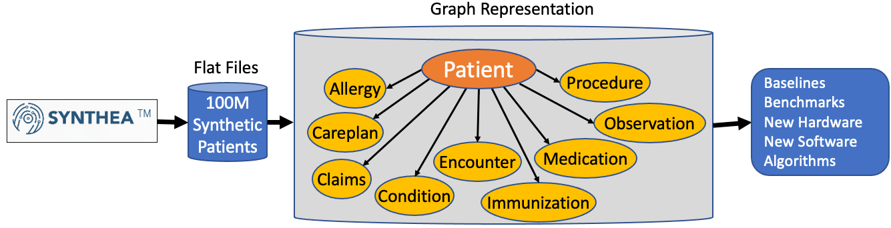

# Synthetic Clinical Data Benchmarking



This microsite describes the generation of synthetic clinical data and the loading of this data into a distributed graph database such as [TigerGraph](tigergraph.com) for benchmarking purposes.

The process of generating large collections of clinical graph data can be used for:

* Establishing the baseline performance for bringing an entire clinical record for a patent when there are millions of patients in the system
* Understanding the query performance impact of different representations of clinical data
* Understanding the performance impact of features such as enabling role-based access control
* Creating benchmarks for clinical queries
* Comparing the impact of new hardware and software on clinical systems
* Comparting graph queries to non-graph options
* Testing the performance and feasibility of new algorithms such as real-time fraud detection

## Background

[Synthea](https://synthetichealth.github.io/synthea/) is a tool for generating synthetic healthcare records.  The current version generates a patient record and related clinical information such as allergies, claims, diagnosis, prescriptions, vaccinations, etc.  You can generate any arbitrary-sized patient population, you are only limited by the disk space on your servers.

## Typical Usage

A typical use is the following command:

```sh
$ synthea_run -p 10000
```

Which will generate the thousand sample patient records with the data broken into CSV files:

```sh
$ ls data/*.csv
allergies.csv 12126 
careplans.csv 20524 
claims.csv 7041 
conditions.csv 20525 
encounters.csv 13190 
immunizations.csv 6049 
medications.csv 79675 
observations.csv 1463 
patients.csv 10000 
procedures.csv 5380
```

You can then load this data into your graph database.

The default export format is FHIR, but we find that changing the config files to generate CSV files is more efficient.

After the files are generated, you can use the tools in this repository to load this data into TigerGraph.


